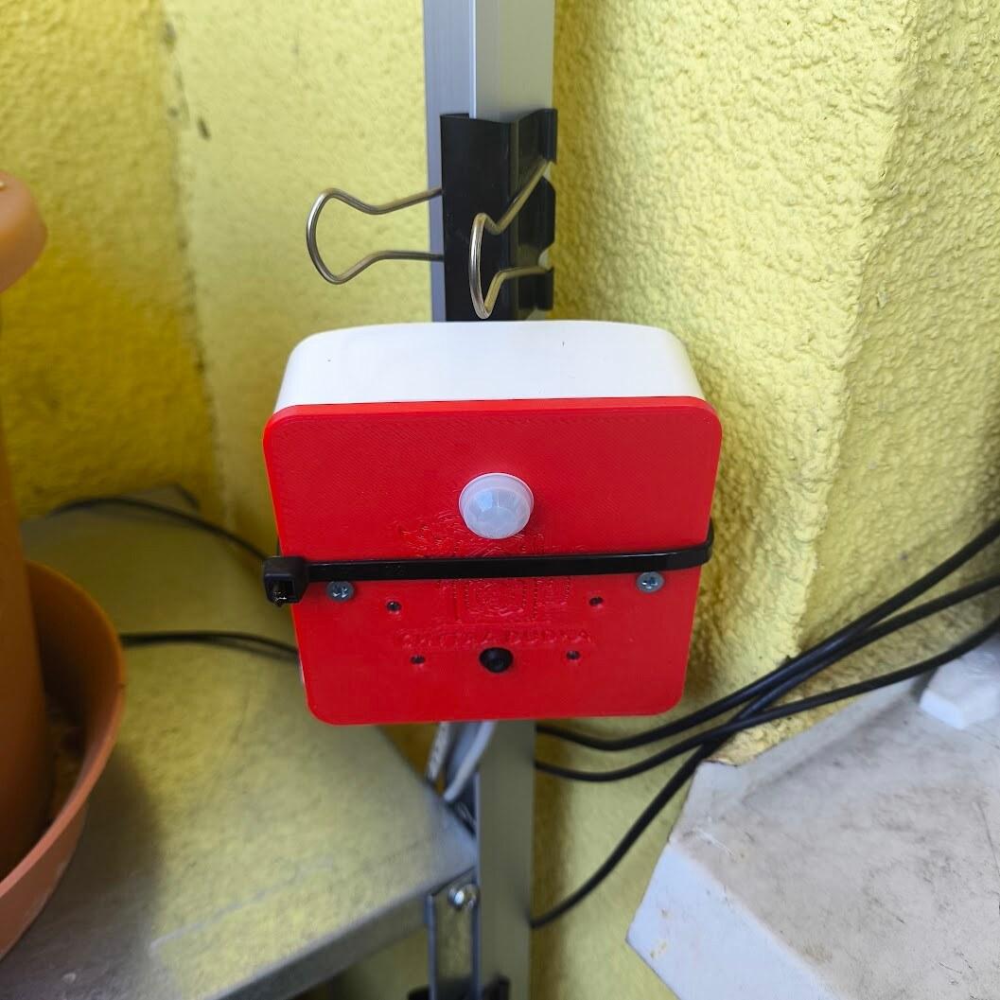
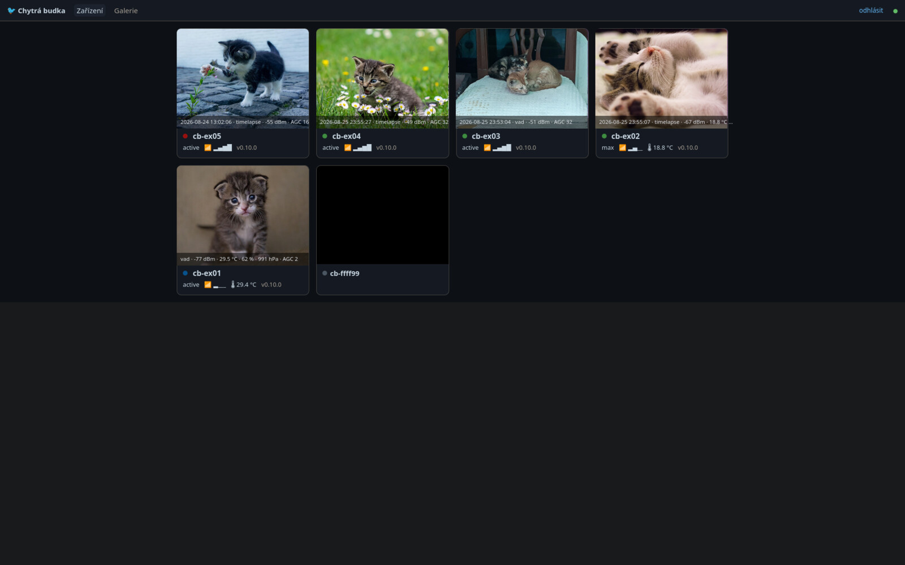
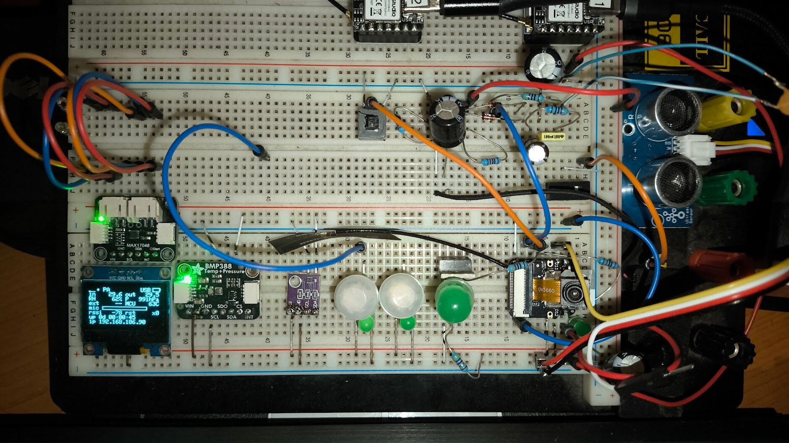

# Chytrá Budka — Solar-Ready Wildlife Camera/Mic Box

[](https://github.com/TeTeHacko/chytra-budka/actions/workflows/lint.yml)

A bird/wildlife monitoring box built toward solar autonomy: camera,
microphone, environmental sensors, WiFi — designed to run from a solar-topped
battery. Audio streams to [BirdNET-Go](https://github.com/tphakala/birdnet-go) for
species identification; photos and telemetry go to Home Assistant over MQTT.

<p align="center">
  
  <br>
  <em>The pilot unit — IP65 box, 3D-printed faceplate with PIR, camera and IR fill.</em>
</p>

> **Power status, honestly:** the units fielded so far run from **USB /
> powerbank** (the tested interim: a cheap folding panel topping up a powerbank).
> The firmware side of solar autonomy is in place and measured (fuel-gauge SOC
> modes, light-sleep) — see [firmware/POWER.md](firmware/POWER.md) — but the
> solar + battery charging hardware is not built yet; no autonomous solar node
> is deployed.

Built around a **Seeed XIAO ESP32-S3 Sense** in an off-the-shelf IP65 enclosure,
running native **ESP-IDF v6.0.1** firmware.

**License:** GPL-3.0 (firmware) + CC-BY-SA-4.0 (hardware/docs) — see [License](#license).

> **Open hardware + firmware — build your own.** The hostnames, IPs, and the
> deployment site in these docs are **the author's own setup as a worked
> example** — substitute your own everywhere. A self-hostable server stack
> (mTLS MQTT broker, certificate enrollment, OTA store, management UI, audio
> relay, Prometheus exporter) lives in [`server/`](server/README.md); the
> author's Home Assistant dashboards and site-deployment glue stay private.
> New here? → [SHOPPING.md](SHOPPING.md) (what to buy) →
> [WIRING.md](WIRING.md) (how to wire it) → [firmware/README.md](firmware/README.md) (build & flash).

**How much do you need to build?** Pick a tier:

1. **Nothing (yet)** — [try the stack + UI with a simulated device](#try-it-without-hardware), zero hardware.
2. **A bench board** (~€28, USB-powered) — the full firmware on a breadboard, against any MQTT broker you already have (Home Assistant discovery included); relay/OTA/HTTPS-enrollment all optional. No toolchain needed to start: a [prebuilt image is in Releases](https://github.com/TeTeHacko/chytra-budka/releases).
3. **The full self-hostable stack** ([`server/`](server/README.md)) — mTLS broker, enrollment CA, OTA store, web UI; for running a fleet over the public internet.

Per-device HTTPS, signed OTA and Secure Boot further down are the *hardening
ladder*, not the entry bar — a bench board with placeholder secrets works out
of the box.

## Features

- **Solar-ready firmware** — fuel-gauge SOC + hybrid power modes + measured
  light-sleep (~0.40 W in Safe) already in place; the solar/battery charging
  hardware is future work, fielded units run on USB/powerbank.
- **Hybrid power modes** — continuous streaming when the battery is healthy,
  sound-triggered bursts when it's low, a power-staged safe mode at the bottom
  (light-sleep capable, deep-sleep hibernate on operator command; the
  automatic tiers never deep-sleep in practice — see
  [firmware/POWER.md](firmware/POWER.md)).
- **Audio → BirdNET** — onboard PDM mic, VAD-gated WiFi burst streaming.
- **Camera photo-trap** — OV3660 triggered by PIR / VAD / MQTT, with 940 nm IR
  night illumination invisible to birds.
- **Environmental sensing** — ambient temperature + humidity (SHT41), optional
  solar V/I (INA226), reed door/lid contact.
- **Home Assistant native** — MQTT auto-discovery for every sensor + control.
- **Per-device HTTPS** — the box self-enrolls a TLS cert on first boot.
- **OTA updates** — periodic HTTPS poll, no field disassembly.
- **Fleet management UI** — the self-hostable [`server/`](server/README.md)
  stack: device grid, photo gallery, OTA rollout, enrollment approvals.


*The [management UI](server/README.md) device grid. (Camera thumbnails swapped
for CC0 kittens before publishing.)*

## Try it without hardware

The server stack runs from docker compose, and
[`server/scripts/fake-device.py`](server/scripts/fake-device.py) simulates a
board against it — the UI above comes alive with no hardware and no ESP-IDF,
just docker and python:

```sh
cd server
cp .env.example .env              # BUDKA_DOMAIN=example.com works locally
./scripts/init-secrets.sh && ./scripts/dev-pki.sh
docker compose up -d --build

python3 -m venv .venv && .venv/bin/pip install aiomqtt pillow
.venv/bin/python scripts/fake-device.py --host localhost --port 8884 \
    --user svc-ops --password-file secrets/svc_ops_pass
```

Add `127.0.0.1 budka.example.com` to `/etc/hosts`, open
<https://budka.example.com>, accept the self-signed placeholder certificate
(Let's Encrypt takes over in a real deployment) and log in with the operator
password from `server/secrets/operator_password`.

## How it works

```
[USB-C 5V — bench PSU, mains adapter or powerbank]
       │       (a solar+battery charging stage is designed, not yet built —
       ▼        the firmware is ready for it, see firmware/POWER.md)
[XIAO ESP32-S3 Sense] ── OV3660 camera (detachable; AliExpress variant ships OV3660)
       │                  onboard PDM mic (MSM261D3526H1CPM, GPIO 41/42)
       │                  microSD slot (SDIO 1-bit, GPIO 7/8/9)
       ├── MAX17048 I²C fuel gauge (true SOC % for battery builds, addr 0x36)
       ├── SHT41 ambient T/RH (addr 0x44)
       ├── AM312 PIR motion (GPIO 2 / D1, RTC-capable wake)
       ├── 940 nm IR LED via AO3400 (GPIO 3 / D2, LEDC PWM)
       ├── Capture indicator LED (GPIO 4 / D3, active-high)
       └── U.FL → SMA bulkhead → external 2.4 GHz dipole
       │
       ▼ WiFi
[server (the author's example stack)]
  ├── relay (HTTP chunks → ffmpeg → RTSP via mediamtx)
  ├── BirdNET-Go (consumes RTSP)
  ├── Home Assistant (MQTT: mode / SOC / detection telemetry)
  └── Video-on-Demand endpoint (camera trigger via MQTT)
```

The firmware switches between three modes based on battery SOC (read from the
I²C MAX17048 fuel gauge; with no fuel gauge fitted it stays in Sound-triggered):

| Mode                | Trigger                                   | What it does                                                |
| ------------------- | ----------------------------------------- | ----------------------------------------------------------- |
| **Continuous**      | enter at SOC ≥ 65 %, leave below 50 %      | Continuous audio stream + Video-on-Demand camera trigger    |
| **Sound-triggered** | the default; holds between 30 % and 65 %   | VAD detector listens; on threshold → 30 s WiFi burst stream |
| **Safe**            | enter below 30 %, recover at ≥ 35 %        | Audio off, WiFi power-save, opt-in light-sleep; recovers to Sound-triggered |

Measured draw: ~1.1 W in every always-on mode (the WiFi + 240 MHz baseline
dominates), ~0.40 W in Safe with light-sleep enabled — numbers and method in
[firmware/POWER.md](firmware/POWER.md).

## Hardware

XIAO ESP32-S3 Sense (onboard camera + PDM mic + microSD) + a handful of I²C
sensors in an IP65 box, powered over USB (a solar + battery charging stage is
designed but not yet built). Full details:


*The bench rig — everything the firmware supports, wired at once: OLED status
page, fuel gauge, BMP388, PIR, sonar, OV3660.*

- **[SHOPPING.md](SHOPPING.md)** — bill of materials (with AliExpress search terms + prices)
- **[WIRING.md](WIRING.md)** — wire-by-wire ("module label → XIAO pad") build guide
- **[SCHEMATIC.md](SCHEMATIC.md)** — block diagram + pin assignment
- **[firmware/hw/](firmware/hw/)** — KiCad project + carrier-PCB design

## Firmware

Native ESP-IDF v6.0.1 (mbedTLS 4.0.0) for the XIAO ESP32-S3. Hybrid mode FSM,
MQTT auto-discovery, per-device HTTPS self-enrollment, and OTA. See
**[firmware/README.md](firmware/README.md)** for the build, tests, and the
production-hardening path, and **[RUNNING.md](RUNNING.md)** for what to expect on
first boot and the usual gotchas.

### Quick start

> No-toolchain option: a prebuilt, ready-to-flash bench image lives in
> [Releases](https://github.com/TeTeHacko/chytra-budka/releases) —
> `pip install "esptool>=5"` and one `write-flash` are all it takes.

```bash
# ESP-IDF v6.0.1 is the only supported toolchain — install guide:
#   https://docs.espressif.com/projects/esp-idf/en/v6.0.1/esp32s3/get-started/index.html
. ~/esp/esp-idf/export.sh                 # wherever your v6.0.1 checkout lives

cp firmware/main/secrets.h.example firmware/main/secrets.h
# Placeholders are fine: WiFi provisions later via the AP portal, and with no
# MQTT broker / relay / OTA server those features just stay quiet.
# Optionally point MQTT_HOST (and RELAY_HOST / OTA_URL, if you run those) in
# firmware/main/config.h at your network — or set them later at runtime over
# MQTT (`cmd/endpoint`). The committed defaults are documentation IPs; leaving
# them is safe.
firmware/tools/fetch_le_roots.sh          # cert-bundle input the build requires (gitignored)
firmware/tools/build.sh bench             # applies the sdkconfig overlay chain + builds
firmware/tools/build.sh bench flash monitor
```

Details, tests, and the production-hardening path: [firmware/README.md](firmware/README.md).

## Repository layout

| Path           | Purpose                                                                                           |
| -------------- | ------------------------------------------------------------------------------------------------- |
| `README.md` | This file — project overview |
| [`SHOPPING.md`](SHOPPING.md) | Bill of materials (single source for parts + prices) |
| [`WIRING.md`](WIRING.md) | Wire-by-wire build guide ("module label → XIAO pad") |
| [`RUNNING.md`](RUNNING.md) | First boot: how to run it, what to expect, common gotchas |
| [`SCHEMATIC.md`](SCHEMATIC.md) | Block diagram + wiring detail |
| [`firmware/`](firmware/README.md) | ESP-IDF v6.0.1 firmware (hybrid FSM, MQTT, HTTPS enrollment, OTA) + native & HIL tests |
| [`firmware/hw/`](firmware/hw/README.md) | KiCad hardware project + carrier-PCB design |
| [`server/`](server/README.md) | Self-hostable server stack: nginx TLS edge, mosquitto (mTLS), device manager (enrollment CA, OTA store, gallery UI), RTSP — docker compose |
| [`host/`](host/README.md) | Host-side helpers (udev rules for MAC-pinned bench serial symlinks) |
| [`CONTRIBUTING.md`](CONTRIBUTING.md) · [`SECURITY.md`](SECURITY.md) · [`CHANGELOG.md`](CHANGELOG.md) | Contribution flow, vuln reporting, changelog |

> **Server side:** the stack in [`server/`](server/README.md) is the supported,
> self-hostable way to run a fleet (no Home Assistant required); it builds the
> audio relay and the MQTT→Prometheus exporter from [`relay/`](relay/README.md)
> and [`metrics-bridge/`](metrics-bridge/README.md). The author's HA packages
> and site-deployment glue (Ansible, dashboards) aren't published.

## Status & roadmap

Current hardware: **rev3.2** — XIAO ESP32-S3 Sense (onboard camera + PDM mic)
in an off-the-shelf IP65 box. Recent changes in [CHANGELOG.md](CHANGELOG.md).

**Works today:** photo-trap camera with IR night fill, VAD-gated audio →
BirdNET, MQTT/Home Assistant integration, per-device HTTPS enrollment, signed
OTA with verify-on-update (hardware Secure Boot v2 on the field unit).

**Planned:**

- autonomous solar + battery power node — measured power budget in
  [firmware/POWER.md](firmware/POWER.md)
- Flash Encryption + eFuse lockdown
- winter (sub-zero) hardware revision

Stuck or curious? [Open an issue](https://github.com/TeTeHacko/chytra-budka/issues)
— bug reports, hardware notes and questions welcome; what to include is in
[CONTRIBUTING.md](CONTRIBUTING.md).

## License

Dual-licensed by component type:

- **Software / firmware** (everything under `firmware/`, and the server-side
  code) — **GNU GPL-3.0-or-later** ([`LICENSE`](LICENSE)).
- **Hardware design + documentation** (schematics, wiring, BOM, the `*.md` docs)
  — **CC-BY-SA-4.0** ([`LICENSE-docs`](LICENSE-docs)).

SPDX: `GPL-3.0-or-later` (code), `CC-BY-SA-4.0` (hardware/docs).
