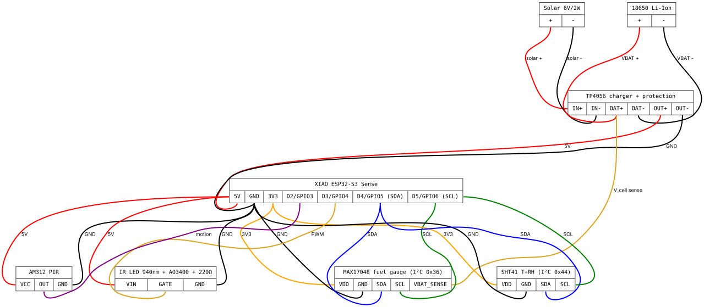

# Chytrá Budka — Wiring Schematic (rev. 3.2 — hybrid, off-the-shelf, low-quiescent, photo-trap)

> **Power-stage status:** the solar/battery chain drawn here (WaveShare PMM +
> 2× 18650) is the designed target — units built so far are powered over USB
> (bench/PC or powerbank). See [firmware/POWER.md](firmware/POWER.md).

> **rev3.2 changes vs rev3.1:** OV3660 camera firmware-enabled (photo-trap mode), SHT41 ambient T+RH sensor added on shared I²C bus, AM312 PIR + 940 nm IR LED added for motion-triggered captures. KiCad project lives in [`firmware/hw/`](firmware/hw/) (build via `make`). See [`firmware/hw/README.md`](firmware/hw/README.md) for KiCad library setup and pin assignment.

## Wiring diagram

Component-level block diagram with colored wires (red = +5V/VBAT, orange = +3V3, black = GND, blue = SDA, green = SCL, goldenrod = PWM/sense, purple = PIR signal):



Source: [`firmware/hw/wiring.dot`](firmware/hw/wiring.dot) — render with `make -C firmware/hw wiring`.

## Block Diagram

```
                    ┌──────────────────────────────────────────────────┐
                    │           IP65 ABS Box (100×68×50 mm)            │
                    │                                                  │
   sun ☀️           │   ┌──────────────────────────────────┐           │
   ─────┐           │   │  WaveShare Solar Power Manager   │           │
        │           │   │      (basic, CN3791-based)       │           │
        ▼           │   │                                  │           │
   ┌─────────┐ +    │   │   Solar IN (DC jack): 6-24 V     │           │
   │ Solar   │──────┼──►│   ─────► CN3791 MPPT charger     │           │
   │ panel   │ −    │   │                                  │           │
   │ 18V 10W │──────┼──►│   PH2.0 BAT connector ──────┐    │           │
   └─────────┘      │   │                              │   │           │
   (cable gland)    │   │   USB OUT: 5V / 1A          │    │           │
                    │   │   Quiescent: <2 mA          │    │           │
                    │   └────────────────┬─────────────│───┘           │
                    │                    │ 5V          │               │
                    │   ┌────────────────│─────────────│───────────┐  │
                    │   │  External 2× 18650 holder    │           │  │
                    │   │  (1S2P parallel)             │           │  │
                    │   │  + DW01+8205A protection PCB ◄───────────┘  │
                    │   │   PH2.0 lead ◄───────────────┘ │           │  │
                    │   │   ──── tap to MAX17048 ───┐    │           │  │
                    │   └────────────────────────────│────┘           │  │
                    │                                │                │  │
                    │   ┌─────────────────────┐      │ V_BAT,GND      │  │
                    │   │  MAX17048 fuel gauge │ ◄───┘                │  │
                    │   │  I²C 0x36           │                        │  │
                    │   └──┬──────────────────┘                        │  │
                    │      │ SDA/SCL                                    │  │
                    │      ▼                                            │  │
                    │   ┌──────────────────────────────────────┐       │  │
                    │   │  XIAO ESP32-S3 Sense                 │       │  │
                    │   │                                      │       │  │
                    │   │  ● 5V ◄────────── WaveShare USB 5V   │ ◄─────┘  │
                    │   │  ● GND ◄──────── WaveShare GND       │          │
                    │   │                                      │          │
                     │   │  ● D4 (SDA) ◄─► MAX17048 SDA         │          │
                     │   │  ● D5 (SCL) ◄─► MAX17048 SCL         │          │
                     │   │                                      │          │
                     │   │  I²S PDM mic (onboard MSM261D3526):  │          │
                      │   │   ● GPIO42 PDM_CLK                   │          │
                      │   │   ● GPIO41 PDM_DATA                  │          │
                      │   │   (no external mic — pin conflict    │          │
                      │   │    with SDIO microSD slot)           │          │
                      │   │                                      │          │
                      │   │  microSD slot (Sense expansion):     │          │
                      │   │   ● D8/GPIO7  SDMMC CLK              │          │
                      │   │   ● D9/GPIO9  SDMMC CMD              │          │
                      │   │   ● D10/GPIO8 SDMMC DAT0 (1-bit)     │          │
                      │   │                                      │          │
                      │   │  SHT41 (T+RH ambient): I²C 0x44      │          │
                      │   │   ● D4 SDA, D5 SCL (shared)          │          │
                      │   │                                      │          │
                      │   │  AM312 PIR wake source:              │          │
                      │   │   ● D1 (GPIO2, RTC) ◄── PIR OUT      │          │
                      │   │                                      │          │
                      │   │  IR LED 940 nm (night photo-trap):   │          │
                      │   │   ● D2 (GPIO3) PWM → MOSFET → LED    │          │
                      │   │                                      │          │
                      │   │  [OV3660 cam ENABLED — photo-trap]   │          │
                     │   │  [WiFi via U.FL → SMA bulkhead]      │          │
                    │   └──────────────────────────────────────┘          │
                    │                                                     │
                    │   Camera lens ─► hole in lid (Ø10) sealed           │
                    │   SMA bulkhead ──► side wall (ext antenna)          │
                    │   Solar cable ───► cable gland on side              │
                    │   Drain hole 2mm ► bottom (anti-condensate)         │
                    └─────────────────────────────────────────────────────┘
                                  ▲
                                  │ WiFi 2.4 GHz (SMA dipole)
                                  │ + OTA flashing + audio chunks
                                  ▼
                       ┌───────────────────────────────┐
                       │  server-host                   │
                       │  - audio_relay (HTTP→RTSP)    │
                       │  - BirdNET-Go (RTSP consumer) │
                       │  192.0.2.x                 │
                       └───────────────────────────────┘
```

## Wiring Detail

### Power path

- Solar panel → DC plug → cable gland → WaveShare Solar IN (DC jack)
- WaveShare onboard 14500 holder **unused** — leave empty
- WaveShare PH2.0 BAT connector → 4-wire harness:
  - +/− to external 2× 18650 1S2P holder (with onboard PCM protection)
  - +/− also tapped to MAX17048 V_BAT/GND
- WaveShare USB-A or USB-C OUT (5V/1A) → short cable → XIAO USB-C
- WaveShare GND → XIAO GND

### External 2× 18650 holder

- Plastic holder for two 18650 cells in parallel (1S2P)
- Onboard PCM (DW01 + 8205A) provides:
  - Overcharge protection: trips at 4.30V
  - Overdischarge: trips at 2.50V
  - Short-circuit + overcurrent
- Cells **must be matched**: same brand, same capacity, ideally same lot
- JST-PH 2.0 lead matches WaveShare BAT input

### I²C SOC monitoring (MAX17048)

| Bus | XIAO pin   | MAX17048 pin |
| --- | ---------- | ------------ |
| SDA | D4 (GPIO5) | SDA          |
| SCL | D5 (GPIO6) | SCL          |
| VCC | 3V3        | VCC          |
| GND | GND        | GND          |

VBAT/GND of MAX17048 wired direct to battery + and −. ESP32 reads SOC % at I²C address 0x36. No calibration needed — MAX17048 has internal fuel-gauge model for Li-Ion.

### I²S PDM mic (onboard, rev3.2)

XIAO ESP32-S3 **Sense** has the MSM261D3526H1CPM PDM microphone built in.

| Mic signal | XIAO internal pin |
| ---------- | ----------------- |
| PDM_CLK    | GPIO42            |
| PDM_DATA   | GPIO41            |

No external INMP441 — that conflicted with the SDIO microSD slot (GPIO 7/8/9). PDM SNR ~61 dB is acceptable for BirdNET classification at the cost of slightly noisier audio than INMP441 would have given.

### microSD slot (Sense expansion, SDIO 1-bit)

| SD signal | XIAO pin    |
| --------- | ----------- |
| CLK       | D8 (GPIO7)  |
| CMD       | D9 (GPIO9)  |
| DAT0      | D10 (GPIO8) |

Mounted as `/sdcard` (FATFS). Used for JPEG capture persistence. 1-bit mode because the Sense expansion only routes DAT0.

### PIR sensor AM312 (rev3.2 — required for photo-trap)

| AM312 pin | XIAO pin                             |
| --------- | ------------------------------------ |
| VCC       | 3V3                                  |
| GND       | GND                                  |
| OUT       | D1 (GPIO2) RTC-capable — wake source |

### SHT41 ambient temp + humidity (rev3.2)

| SHT41 pin | XIAO pin                |
| --------- | ----------------------- |
| VDD       | 3V3                     |
| GND       | GND                     |
| SDA       | D4 (GPIO5) — shared I²C |
| SCL       | D5 (GPIO6) — shared I²C |

I²C address 0x44. Reports T (±0.2 °C) and RH (±1.8 %), 0.4 µA idle. Used for ambient logging, condensation alarm (RH > 80 % inside box → MQTT warning), and triggering desiccant replacement service.

**Note:** ESP32-S3 has internal temperature sensor (`temperature_sensor.h` API) but it measures die temperature with ±5–15 °C offset under load — not usable as ambient.

### IR illumination LED 940 nm (rev3.2 — night photo-trap)

| Pin    | XIAO pin   | Notes                                      |
| ------ | ---------- | ------------------------------------------ |
| anode  | via 220 Ω  | from XIAO 3V3 rail through MOSFET drain    |
| gate   | D2 (GPIO3) | LEDC PWM, 5 kHz, only enabled during capture |
| source | GND        |                                            |

940 nm IR is invisible to most birds (peak avian sensitivity 350-700 nm) — captures wildlife without disturbing them. Powered only during photo capture (~500 ms per event), zero idle drain.

### Camera OV3660 (rev3.2 — onboard XIAO Sense, firmware-enabled)

CSI bus internal to XIAO Sense module — no external wiring. Software stack:

- `esp32-camera` IDF managed component
- JPEG capture 1600×1200 (UXGA) default, quality 8 (`cam_quality` NVS-tunable 4–32, lower = better), ~100–200 KB per frame depending on scene complexity
- Triggers: PIR (D1 wake), VAD burst (audio-driven), MQTT command from server
- Output: store JPEG on microSD, push thumbnail (320×240, ~15 KB) over MQTT, full-res over HTTP POST to relay
- Power: ~70 mA during 200-500 ms capture, idle off (camera_deinit between events)

### Runtime pin function map (rev3.2, firmware ≥ 680721f)

The per-peripheral D-pin assignments listed above are the **rev3.2 defaults baked into the schema**. Each of D0–D7 is runtime-reassignable via the `pin_d{0..7}_fn` schema knobs (HA dashboard "Pin map" section or MQTT `cmd/cfg/pin_dN_fn <label>`). Changes take effect at next boot — `apply_side_effects` emits a "reboot required" log line but does not rebind live modules.

Valid function labels: `none`, `reed`, `pir`, `ir_led`, `capture_led`, `i2c0_sda`, `i2c0_scl`, `i2c1_sda`, `i2c1_scl`, `uart_tx`, `uart_rx`.

Cross-validation rules:

- **Singletons** (`ir_led`, `capture_led`, `uart_tx`, `uart_rx`) — at most one slot per function; setter rejects a second assignment with `ESP_ERR_INVALID_ARG`.
- **Pairs** (`i2c0_sda`/`scl`, `i2c1_sda`/`scl`, `uart_tx`/`rx`) — both halves must be present or both absent. Half-broken pair logs a warning and the affected module (`i2c_bus.c` / `uart_servo.c`) refuses to init at boot rather than running on a single line.
- **D6/D7 (GPIO43/44) console caveat** — these double as the ROM bootloader UART (U0TXD/U0RXD). When reassigned to `uart_*`, bootloader log emerges on the pin at 115200 8N1 every boot; expected and harmless (console output is on USB-Serial-JTAG, not UART0) but visible.

**Multi-instance support**: `reed` and `pir` are not singletons — each can be assigned to up to `REED_MAX_INSTANCES`/`PIR_MAX_INSTANCES` (4) slots. Firmware enumerates them as `state/reed_0..3` and `state/motion_0..3` MQTT topics; instance 0 keeps the legacy unsuffixed name for backward compatibility.

Operator visibility: `GET /` on each device renders the current map (slot → GPIO → function) so the live binding is verifiable without checking NVS or rebooting.

## Hybrid Firmware Logic

```
boot
 ↓
read SOC from MAX17048
 ↓
┌──────────────────────────┬────────────────────┐
│ SOC > 50%?               │ SOC < 30% (critical)│
│  yes → CONTINUOUS MODE   │  yes → SAFE MODE   │
└──────────┬───────────────┴────────────┬───────┘
           ▼                             ▼
   continuous mode                safe mode
   ─────────────                  ─────────
   - WiFi up                      - WiFi off
   - PDM sample @ 16 kHz stereo   - deep sleep 30 min
   - HTTP stream chunks           - wake → check SOC
   - VoD camera trigger via       - if SOC > 35%, switch
     MQTT command from server       to sound-triggered mode
   - SOC re-read every 5 min      - else sleep again
   - if SOC drops <50% →
     switch to sound-triggered
           ▲                                 ▲
           │                                 │
           │       sound-triggered mode      │
           │       ────────────────────      │
           │       - I²S running, low-power  │
           │         CPU + WiFi modem off    │
           │       - VAD threshold detector  │
           │       - if level > T:           │
           │           WiFi up               │
           │           stream 30s burst      │
           │           WiFi off              │
           │       - if SOC > 65% → continuous │
           └─────────────────────────────────┘
```

Hysteresis prevents thrashing: continuous→sound-triggered at 50%, sound-triggered→continuous at 65%.

Critical SOC = 30% triggers safe mode (sleep + occasional check) to protect battery from deep discharge.

## Server-side audio relay

ESP32 streams **16 kHz stereo s16le PCM** (raw L16 per RFC 3190) in HTTP/1.1 chunked POSTs to
`relay/relay.py` on `server-host:8765` with a Bearer token. The relay
spawns one ffmpeg per stream name that re-encodes (no-op transcode for
`pcm_s16le`) and pushes RTSP into the local mediamtx instance on
`:8554`. BirdNET-Go pulls `rtsp://127.0.0.1:8554/chytra-budka` and
consumes it identically to any other RTSP source — no BirdNET-Go
config changes beyond adding the URL.

Implementation lives in `relay/`:

- single-writer guard per stream (no PCM mixing)
- `gap_silence` linger keeps the RTSP path alive across short WiFi
  flaps so BirdNET-Go does not lose its inference window
- Prometheus `/metrics`, JSON `/streams`, idle/total watchdogs
- systemd unit + idempotent `install.sh`
- host E2E test that drives the same C++ `Vad`/`ChunkedPoster` code the
  ESP32 runs against the real relay (`relay/test-e2e.sh`, 12/12)

TLS is terminated upstream (VPN tunnel or LB), so the relay itself
listens plain HTTP.

## Power Budget (rev3, summer an upland forest site, tree shade)

| Mode                                    | Current avg | Wh/day |
| --------------------------------------- | ----------- | ------ |
| Continuous + VoD (≥50% SOC)             | 150 mA      | 13     |
| Sound-triggered burst (30-50% SOC)      | 12 mA       | 1.1    |
| Safe / deep sleep (<30% SOC)            | 0.5 mA      | 0.05   |
| Solar input (10W panel, shade, 4 sun-h) | —           | ~5     |

| Battery (2× 18650 NCR18650B parallel) | 25 Wh |

**Realistic operation pattern:**

- After clear days battery climbs to 100% → 1-2 days continuous mode → drops to 50% → switches to sound-triggered → solar replenishes 1-2 days → climbs back to 65% → switches back to continuous → cycle repeats
- Net: ~25-30% time in continuous, ~70% in sound-triggered, dawn chorus prioritized
- In bad weather (3+ overcast days): falls into safe mode, recovers automatically

## Firmware Strategy

1. **Initial flash via USB-C** with battery removed from holder
2. **OTA enabled** — all updates over WiFi
3. **MQTT to HA** for SOC, mode, detection telemetry (mirrors existing BirdNET-Go architecture)
4. **Watchdog** with 3× boot fail rollback
5. **Mode logic** as above

## Assembly Order

1. **Bench prep:**
   - [ ] Charge 2× 18650 cells separately to 4.20 V on Li-Ion charger
   - [ ] Print inner mounting bracket (PETG, 0.6 mm nozzle) holding XIAO + WaveShare module
   - [ ] Solder U.FL pigtail if not factory-fitted
   - [ ] Initial firmware flash via USB-C (no battery), configure OTA + MQTT
   - [ ] Bench test: onboard PDM mic captures audio, MAX17048 SOC visible in HA, mode switching works, camera capture works
2. **Box integration:**
   - [ ] Drill IP65 box: cam hole Ø10 mm in lid (sealed with silicone + acrylic disc), PIR Fresnel Ø8 mm, IR LED Ø3.5 mm, SMA bulkhead Ø6.5 mm side wall, 1× M16 cable gland (solar), 2 mm drain hole bottom
   - [ ] Mount inner bracket via M3 inserts to lid
   - [ ] Insert 18650 cells, plug solar cable through gland, plug USB-C from WaveShare to XIAO
   - [ ] SMA bulkhead → external dipole on outside
   - [ ] Silica gel sachet inside, close lid with gasket
3. **Field deploy:**
   - [ ] Mount IP65 box inside or under bird-feeder/budka roof on a temperate mountain range tree
   - [ ] Solar panel on tree branch above canopy if possible (cable run to box)
   - [ ] External antenna pointing toward house AP through window
   - [ ] Verify RSSI > -75 dBm before sealing

## Test Checklist

- [ ] WaveShare 5V output stable with both solar + battery
- [ ] MAX17048 reads SOC correctly over I²C from XIAO (address 0x36)
- [ ] Battery SOC matches multimeter readings within 5%
- [ ] Camera streams via web interface
- [ ] Onboard PDM mic captures audio at 16 kHz stereo (relay resamples to 48 kHz mono for BirdNET-Go), RMS reasonable
- [ ] Audio chunks reach server-host relay
- [ ] Relay produces RTSP stream consumable by BirdNET-Go
- [ ] Mode switching: simulate low SOC by disconnecting solar, verify continuous → sound-triggered transition
- [ ] OTA flash works
- [ ] Deep-sleep current ≤2 mA (XIAO Sense not as low as bare ESP32-S3)
- [ ] Solar charging confirmed in real shade conditions
- [ ] WiFi RSSI at deployment site > -75 dBm

## Open issues / decisions

- **Audio codec on the wire:** raw PCM 16 kHz stereo s16 = ~512 kbps; FLAC fallback in `audio.cpp` brings it down ~2-3× depending on burst content. Opus 16 kHz mono would be ~16 kbps (~30× smaller than raw) but encoding on ESP32-S3 needs libopus and a per-frame CPU budget we don't currently have headroom for during continuous mode.
- **VoD video on demand:** triggered via MQTT message from server-host. Camera capture single frame or short clip, push to HA / MinIO. Implement after audio works.
- **Critical SOC threshold tuning:** 30% may be too conservative for NCR18650B which has good low-V capacity. Refine after first month of real-world data.
